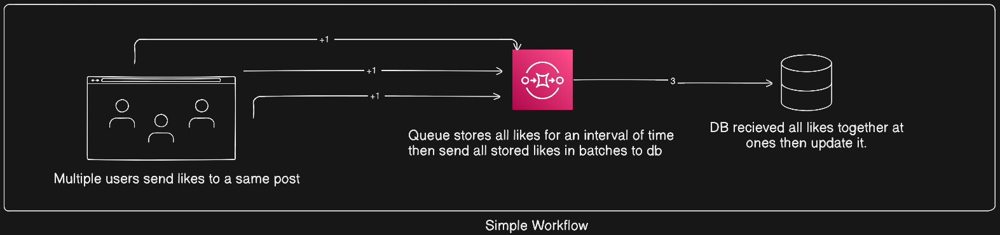

# 🚀 Bulk Like Simulator (Server)

This project demonstrates **high-throughput like handling** using **Redis batching + BullMQ + MongoDB**, along with **real-time visualization via Server-Sent Events (SSE)**.

Instead of writing every like directly to MongoDB, likes are:
1. Aggregated temporarily in Redis
2. Flushed into BullMQ in batches
3. Persisted to MongoDB by a worker
4. Streamed to clients in real time for visualization

This simulates how large-scale systems efficiently handle massive write traffic.

---

## 🧩 System Architecture




## 🧱 Tech Stack

- Node.js + Express
- Redis (counters + Pub/Sub)
- BullMQ (batch queue)
- MongoDB (persistence)
- Server-Sent Events (SSE)
- Docker (Redis + Redis Insight)

---

## 📂 Project Structure

```text
server/
│
├── Producers/
│ └── like.producer.js # Periodically flushes Redis likes to queue
│
├── Workers/
│ └── like.worker.js # Consumes queue & updates MongoDB
│
├── Simulations/
│ └── like.simulation.js # Generates massive like traffic
│
├── Queues/
│ └── like.queue.js
│
├── redis-docker-compose.yml # Redis + Redis Insight
│
└── index.js # Express server + SSE endpoint
 ```


---

## 🧠 MongoDB Schema

```js
const postSchema = new mongoose.Schema(
  {
    title: String,
    likes: {
      type: Number,
      default: 0
    }
  },
  { timestamps: true }
);
```

## Steps to run this project

1️⃣ Start Redis & Redis Insight (Docker)

Make sure Docker is running, then run:

```bash
docker-compose -f redis-docker-compose.yml up
```

2️⃣ Start the Worker (MongoDB Persistence)

Open a new terminal:

```bash
node Workers/like.worker.js
```

The worker:

- Listens to BullMQ

- Updates MongoDB using batch $inc

- Publishes events for visualization


3️⃣ Start the Producer (Batch Creator)

Open another terminal:

```bash
node Producers/like.producer.js
```

The producer:

- Runs on an interval

- Reads Redis counters

- Pushes batch jobs into BullMQ

- Emits Redis → Queue events

4️⃣ Start the Server (API + SSE)

```bash
node index.js
```


Server runs at:
http://localhost:4000

5️⃣ Routes
- POST: /posts  # to create a demo post in mongo db
- POST: /like  # to incremnet likes in mongo db.

6️⃣ Trigger Massive Likes (Simulation)

Run the simulation script:

```bash
node Simulations/like.simulation.js
```

This generates high-volume like traffic:

- Likes hit /like API

- Redis INCR aggregates them

- Producer batches them

- Worker persists them to MongoDB

## 📡 Real-Time Updates via SSE (Client Example)

Clients can subscribe to backend events using Server-Sent Events to get real time like counts update.

# React Example

```js

useEffect(() => {
  const eventSource = new EventSource("http://localhost:4000/events");

  eventSource.onmessage = (event) => {
    const data = JSON.parse(event.data);

    if (data.count) {
      setLikeCount((prev) => prev + Number(data.count));
    }
  };

  eventSource.onerror = (err) => {
    console.error("SSE error", err);
  };

  return () => {
    eventSource.close(); // cleanup
  };
}, []);

 ```
